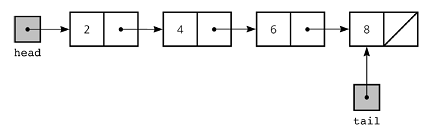

Linked List stores the data in the form of a `node`, is a chain of nodes. Every list node contains the element value and address pointer. The address pointer of the linked list consists of the address of the next node. Unlike `arrays`, linked list elements are not stored at a contiguous location and insertion and deletion of elements are simples since no elements need to be shifted after insertion and deletion.
There are three types of linked lists: [[Singly Linked List]], [[Circular Linked List]], and [[Doubly Linked List]].

## Terminologies of Linked List
- **Head**: The head of a linked list is a pointer to the first node or reference of the first node of linked list. This pointer marks the beginning of the linked list;
- **Node**: Linked list consists of a series of nodes where each node has two parts: `data` and `next pointer`;
- **Data**: Data is the part of node witch stores the information in the linked list;
- **Next pointer**: Next pointer is the part of the node which points to the next node of the linked list.
- **Tail**: last node, points to null.

